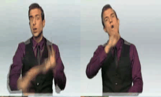
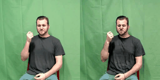

<div align="center">
<h1> Advanced Sign Language Video Generation with Compressed and Quantized Multi-Condition Tokenization </h1>

<p align="center">
  <a href="https://tenvence.github.io/" target="_blank">Cong Wang</a><sup>1*</sup>, 
  Zexuan Deng<sup>1*</sup>, 
  <a href="https://zhiweinju.github.io/" target="_blank">Zhiwei Jiang</a><sup>1†</sup>, 
  <a href="https://muzishen.github.io/" target="_blank">Fei Shen</a><sup>2</sup>, 
  <a href="https://yafengnju.github.io/" target="_blank">Yafeng Yin</a><sup>1</sup>, 
  Shiwei Gan<sup>1</sup>, 
  <a href="https://zifengcheng.github.io/" target="_blank">Zifeng Cheng</a><sup>1</sup>, 
  <a href="https://shipingge.github.io/" target="_blank">Shiping Ge</a><sup>1</sup>, 
  <a href="https://isetnju.github.io/guq/index.html" target="_blank">Qing Gu</a><sup>1</sup>
<br>
<sup>1</sup> Nanjing University,
<sup>2</sup> National University of Singapore
<br>
<sup>*</sup> Equal contribution.
<sup>†</sup> Corresponding authors.
<br><br>
[<a href="https://arxiv.org/abs/2506.15980" target="_blank">arXiv</a>]
<br>
</div>
<!-- # Advanced Sign Language Video Generation with Compressed and Quantized Multi-Condition Tokenization -->

## Video Showcase Gallery

> Note: Left side shows generated GIFs, right side shows original videos.

| Preview | Preview | Preview |
|---------|---------|---------|
|  |  |  |
|  |  |  |
|  |  |  |
|  |  |  |
|  |  |  |
|  |  | |

| Preview | Preview | Preview |
|---------|---------|---------|
|  |  |  |
|  |  |  |
|  |  | |


## Project Structure

```
.
├── configs/               # Configuration files
├── metrics/              # Evaluation metrics
├── models/              # Model architectures
├── pipelines/           # Data processing pipelines
├── scripts/             # Utility scripts
├── signdatasets/        # Dataset handling
├── train.sh             # Training script
├── train_stage_1.py     # Stage 1 training (single frame)
├── train_stage_2.py     # Stage 1 training (Temp.-Attn. Layer)
├── train_compress_vq_multicond.py # Stage 2 training
├── train_multihead_t2vqpgpt.py   # Stage 3 training
└── utils.py             # Utility functions
```

## Training Stages

The system is trained in three main stages:

### Stage I: Sign Video Diffusion Model Training
- **Files**: `train_stage_1.py`, `train_stage_2.py`

### Stage II: FSQ Autoencoder Training
- **File**: `train_compress_vq_multicond.py`

### Stage III: Multi-Condition Token Translator Training
- **File**: `train_multihead_t2vqpgpt.py`

## Setup and Installation

1. Install dependencies:
```bash
pip install -r requirements.txt
```

## Training

The training process can be initiated using the provided training script. Here are the specific commands for each stage:

### Stage I: Sign Video Diffusion Model Training
```bash
# Stage 1: Single frame training
accelerate launch \
  --config_file accelerate_config.yaml \
  --num_processes 2 \
  --gpu_ids "0,1" \
  train_stage_1.py \
  --config "configs/stage1/stage_1_multicond_RWTH.yaml"

# Stage 1: Temporal-Attention Layer training
accelerate launch \
  --config_file accelerate_config.yaml \
  --num_processes 2 \
  --gpu_ids "0,1" \
  train_stage_2.py \
  --config "configs/stage2/stage_2_RWTH.yaml"
```

### Stage II: FSQ Autoencoder Training
```bash
accelerate launch \
  --config_file accelerate_config.yaml \
  --num_processes 2 \
  --gpu_ids "0,1" \
  train_compress_vq_multicond.py \
  --config "configs/vq/vq_multicond_RWTH_compress.yaml"
```

### Stage III: Multi-Condition Token Translator Training
```bash
accelerate launch \
  --config_file accelerate_config_bf16.yaml \
  --num_processes 2 \
  --gpu_ids "0,1" \
  train_multihead_t2vqpgpt.py \
  --config "configs/gpt/multihead_t2vqpgpt_RWTH.yaml"
```

## Data Processing

### Generating VQ Tokens
To process the dataset and generate VQ tokens:
```bash
# Process train dataset
python get_compress_vq_pose_latent.py \
  --config /path/to/config_train.yaml \
  --output_dir /path/to/output/train_processed_videos/ 
# Process validation dataset
python get_compress_vq_pose_latent.py \
  --config /path/to/config_val.yaml \
  --output_dir /path/to/output/val_processed_videos/ 
# Process test dataset
python get_compress_vq_pose_latent.py \
  --config /path/to/config_test.yaml \
  --output_dir /path/to/output/test_processed_videos/ 
```

### Generating Videos
To generate videos from the processed data:
```bash
python eval_compress_vq_video.py \
  --config /path/to/config_test.yaml \
  --input_dir /path/to/test_processed_videos \
  --video_base_path /path/to/original_videos \
  --pose_size 12 # 12 for RWTH, 64 for How2Sign
```

## Evaluation

Several evaluation scripts are provided:
- `eval_multihead_t2vqpgpt.py`: Evaluates the token translator
- `eval_compress_video_from_origin.py`: Evaluates video compression
- `eval_compress_vq_video.py`: Evaluates quantized video compression
- `combined_t2s_eval.py`: Combined evaluation of text-to-sign translation

## Scripts Usage

The project includes several utility scripts organized in the `scripts/` directory:

### Dataset Processing Scripts

#### RWTH-T Dataset Processing
Located in `scripts/RWTH-T/`:
- `1_make_video.py`: Creates video files from raw data
- `2_check_video.py`: Validates video files
- `3_process_annotion.py`: Processes annotation files

#### How2Sign Dataset Processing
Located in `scripts/how2sign/`:
- `1_create_json.py`: Creates initial JSON metadata
- `2_clip_videos.py`: Clips videos to appropriate lengths
- `3_check_clip_videos.py`: Validates clipped videos
- `4_crop_and_resize_videos.py`: Processes video dimensions
- `5_create_final_json.py`: Generates final dataset metadata

#### Other Dataset Scripts
- `scripts/hamer/`: Scripts for processing HAMER dataset
- `scripts/sk/`: Scripts for processing SK(DWPose) dataset

## Citation

If you find SignViP useful for your research and applications, please cite using this BibTeX:
```
@article{wang2025advanced,
  title={Advanced Sign Language Video Generation with Compressed and Quantized Multi-Condition Tokenization},
  author={Wang, Cong and Deng, Zexuan and Jiang, Zhiwei and Shen, Fei and Yafeng, Yin and Shiwei, Gan and Zifeng, Cheng and Shiping, Ge and Qing, Gu},
  booktitle={arXiv preprint arXiv:2506.15980},
  year={2025}
}
```
