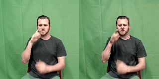

<div align="center">

# Advanced Sign Language Video Generation with Compressed and Quantized Multi-Condition Tokenization

<p align="center">
  <a href="https://tenvence.github.io/">Cong Wang</a><sup>1*</sup>, 
  Zexuan Deng<sup>1*</sup>, 
  <a href="https://zhiweinju.github.io/">Zhiwei Jiang</a><sup>1†</sup>, 
  <a href="https://muzishen.github.io/">Fei Shen</a><sup>2</sup>, 
  <a href="https://yafengnju.github.io/">Yafeng Yin</a><sup>1</sup>, 
  Shiwei Gan<sup>1</sup>, 
  <a href="https://zifengcheng.github.io/">Zifeng Cheng</a><sup>1</sup>, 
  <a href="https://shipingge.github.io/">Shiping Ge</a><sup>1</sup>, 
  <a href="https://isetnju.github.io/guq/index.html">Qing Gu</a><sup>1</sup>
</p>

<p align="center">
  <sup>1</sup> Nanjing University, 
  <sup>2</sup> National University of Singapore <br>
  <sup>*</sup> Equal contribution &nbsp; | &nbsp; <sup>†</sup> Corresponding authors
</p>

[](https://arxiv.org/abs/2506.15980)

</div>

---

## 📑 Table of Contents
- [Project Structure](#project-structure)
- [Training Stages](#training-stages)
- [Setup and Installation](#setup-and-installation)
- [Model Checkpoint](#model-checkpoint)
- [Training](#training)
- [Data Processing](#data-processing)
- [Evaluation](#evaluation)
- [Video Showcase Gallery](#video-showcase-gallery)
- [Scripts Usage](#scripts-usage)
- [Citation](#citation)

---

## 📂 Project Structure
```bash
.
├── configs/                 # Configuration files
├── metrics/                 # Evaluation metrics
├── models/                  # Model architectures
├── pipelines/               # Data processing pipelines
├── scripts/                 # Utility scripts
├── signdatasets/            # Dataset handling
├── train.sh                 # Training script
├── train_stage_1.py         # Stage 1 training (single frame)
├── train_stage_2.py         # Stage 1 training (Temp.-Attn. Layer)
├── train_compress_vq_multicond.py # Stage 2 training
├── train_multihead_t2vqpgpt.py    # Stage 3 training
└── utils.py                 # Utility functions
````

---

## 🏗️ Training Stages

The system is trained in three main stages:

* **Stage I: Sign Video Diffusion Model Training**
  Files: `train_stage_1.py`, `train_stage_2.py`

* **Stage II: FSQ Autoencoder Training**
  File: `train_compress_vq_multicond.py`

* **Stage III: Multi-Condition Token Translator Training**
  File: `train_multihead_t2vqpgpt.py`

---

## ⚙️ Setup and Installation

```bash
pip install -r requirements.txt
```

---

## 📦 Model Checkpoint

* RWTH-T Models: [[huggingface]](https://huggingface.co/umnooob/signvip/tree/main/RWTH)
* How2Sign Models: *comming soon*

---

## 🏋️ Training

### Stage I: Sign Video Diffusion Model

```bash
# Single frame training
accelerate launch \
  --config_file accelerate_config.yaml \
  --num_processes 2 --gpu_ids "0,1" \
  train_stage_1.py --config "configs/stage1/stage_1_multicond_RWTH.yaml"

# Temporal-Attention Layer training
accelerate launch \
  --config_file accelerate_config.yaml \
  --num_processes 2 --gpu_ids "0,1" \
  train_stage_2.py --config "configs/stage2/stage_2_RWTH.yaml"
```

### Stage II: FSQ Autoencoder

```bash
accelerate launch \
  --config_file accelerate_config.yaml \
  --num_processes 2 --gpu_ids "0,1" \
  train_compress_vq_multicond.py \
  --config "configs/vq/vq_multicond_RWTH_compress.yaml"
```

### Stage III: Multi-Condition Token Translator

```bash
accelerate launch \
  --config_file accelerate_config_bf16.yaml \
  --num_processes 2 --gpu_ids "0,1" \
  train_multihead_t2vqpgpt.py \
  --config "configs/gpt/multihead_t2vqpgpt_RWTH.yaml"
```

---

## 📊 Data Processing

### Generating VQ Tokens

```bash
python get_compress_vq_pose_latent.py \
  --config /path/to/config_train.yaml \
  --output_dir /path/to/output/train_processed_videos/
```

(similarly for val/test datasets)

### Generating Videos

```bash
python eval_compress_vq_video.py \
  --config /path/to/config_test.yaml \
  --input_dir /path/to/test_processed_videos \
  --video_base_path /path/to/original_videos \
  --pose_size 12   # 12 for RWTH, 64 for How2Sign
```

---

## 📈 Evaluation

* `eval_multihead_t2vqpgpt.py` → Evaluates token translator
* `eval_compress_video_from_origin.py` → Evaluates video compression
* `eval_compress_vq_video.py` → Evaluates quantized video compression
* `combined_t2s_eval.py` → Combined text-to-sign evaluation

---

## 🎥 Video Showcase Gallery

**RWTH-T Examples**

| Example 1                                                     | Example 2                                                     | Example 3                                                      |
| ------------------------------------------------------------- | ------------------------------------------------------------- | -------------------------------------------------------------- |
|       |  |    |
|  |    |  |

**How2Sign Examples**

| Example 1                                                  | Example 2                                                   | Example 3                                                  |
| ---------------------------------------------------------- | ----------------------------------------------------------- | ---------------------------------------------------------- |
|  |  |  |
|  |   |  |

---

## 📜 Scripts Usage

### RWTH-T Dataset

Located in `scripts/RWTH-T/`:

* `1_make_video.py` → Create videos
* `2_check_video.py` → Validate videos
* `3_process_annotation.py` → Process annotations

### How2Sign Dataset

Located in `scripts/how2sign/`:

* `1_create_json.py` → Create metadata
* `2_clip_videos.py` → Clip videos
* `3_check_clip_videos.py` → Validate clips
* `4_crop_and_resize_videos.py` → Crop & resize
* `5_create_final_json.py` → Final dataset metadata

### Other Datasets

* `scripts/hamer/` → HAMER dataset processing
* `scripts/sk/` → SK (DWPose) dataset processing

---

## 📖 Citation

If you find this work useful, please cite:

```bibtex
@article{wang2025advanced,
  title={Advanced Sign Language Video Generation with Compressed and Quantized Multi-Condition Tokenization},
  author={Wang, Cong and Deng, Zexuan and Jiang, Zhiwei and Shen, Fei and Yin, Yafeng and Gan, Shiwei and Cheng, Zifeng and Ge, Shiping and Gu, Qing},
  journal={arXiv preprint arXiv:2506.15980},
  year={2025}
}
```
